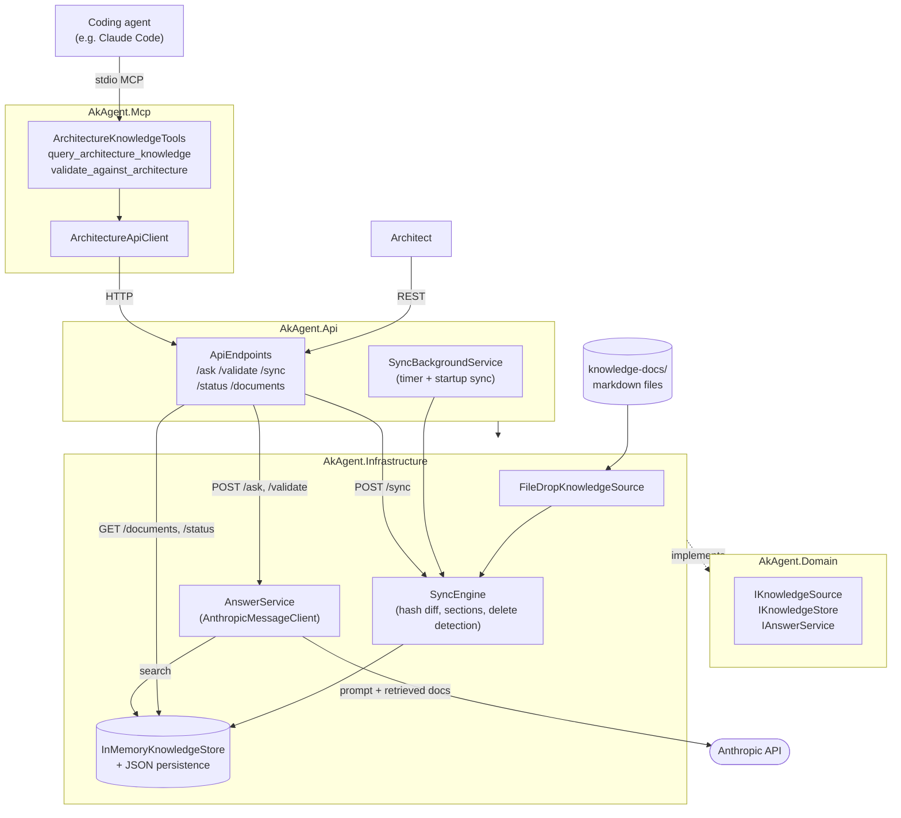

# Architecture Knowledge Agent

A .NET 8 service that indexes architecture documentation (ADRs, guidelines, standards) from
external sources and serves it through two channels:

- **Direct Q&A** — architects ask questions via a REST API and get cited, freshness-aware answers.
- **Guardrails** — the agent plugs into your 3rd party coding agent via MCP to validate planned 
implementation approaches against your custom architecture documentation and guidelines before code is written.

The agent is an index, not a source of truth: documents remain owned by their external source
systems, and the local store is disposable and rebuildable at any time via a full re-sync.

See [`SPEC.md`](SPEC.MD) for the full specification.

## How it works



- Documents are pulled from a **file-drop folder** (`src/AkAgent.Api/knowledge-docs`) of markdown
  files, hashed, split into sections, and indexed in memory (with JSON persistence to disk).
- Sync runs on a timer (default hourly), on demand via `POST /sync`, and once at startup.
- Answers are generated by an Anthropic model, grounded strictly in retrieved documents, with
  citations and staleness always shown. Sub-threshold or empty retrieval yields an explicit
  "not documented" response instead of a guess.

## Project layout

```
src/
  AkAgent.Domain           records, enums, interfaces — no dependencies
  AkAgent.Infrastructure   file-drop connector, in-memory store + JSON persistence, sync engine, Anthropic client
  AkAgent.Api              minimal API host, DI wiring, background sync service
  AkAgent.Mcp              stdio MCP server (calls the REST API)
tests/
  AkAgent.Tests             unit tests
  AkAgent.IntegrationTests  integration tests (WebApplicationFactory)
  fixtures/                 sample knowledge-docs fixture folder
docs/
  mcp-consumer-setup/       templates for wiring a consumer repo's Claude Code to this agent
```

## Prerequisites

- .NET 8 SDK
- An Anthropic API key

## Configuration

Configure via `appsettings.json`, environment variables, or user-secrets (`AkAgent.Api` has a
`UserSecretsId` set up already). **Never commit the API key.**

```json
{
  "Sync":     { "IntervalMinutes": 60 },
  "Store":    { "DataPath": "./data", "MinScore": 0.15, "MaxResults": 5 },
  "FileDrop": { "Path": "./knowledge-docs" },
  "Llm":      { "Model": "claude-sonnet-4-6" },
  "Security": { "ApiKey": "" }
}
```

`Llm:Model` defaults to `claude-sonnet-4-6` if unset — this default is hardcoded in
[`LlmOptions.cs`](src/AkAgent.Infrastructure/Configuration/LlmOptions.cs), not just in
`appsettings.json`. Override it via config to use a different Claude model.

**Before running anything**, set the Anthropic API key as an environment variable in your shell —
the key must never be committed to source or `appsettings.json`:

```bash
# bash
export ANTHROPIC_API_KEY="sk-ant-..."
```

```powershell
# PowerShell
$env:ANTHROPIC_API_KEY = "sk-ant-..."
```

The environment variable must be set in the same shell session/window before you run `dotnet run`
or `dotnet test` — it is not persisted automatically.

Source documents live in the `knowledge-docs` folder (configured by `FileDrop:Path`, defaults to
`./knowledge-docs` relative to the API's working directory — see
[`src/AkAgent.Api/knowledge-docs`](src/AkAgent.Api/knowledge-docs)). Drop your architecture
markdown files (ADRs, guidelines, standards) in there. Files can be freely **added, edited, or
deleted** — the sync engine picks up changes by content hash and removes documents from the index
when their file disappears from the folder. Since this folder is the connector's source, not the
agent's own data, changes only take effect on the next sync (startup, the hourly timer, or a
manual `POST /sync`).

## Running the API

```bash
dotnet run --project src/AkAgent.Api
```

Run this from the repo root (adjust the relative path if you're running it from elsewhere). The
API listens on `http://localhost:5024` by default. On startup it runs an initial sync before
serving queries; `GET /status` reports readiness.

### REST endpoints

| Method & Path       | Purpose                                             |
|----------------------|------------------------------------------------------|
| `POST /ask`           | Ask a question, get a cited answer                   |
| `POST /validate`      | Validate a planned approach against documented architecture |
| `POST /sync`          | Trigger a manual sync                                |
| `GET /status`         | Per-source sync state, doc count, health (readiness) |
| `GET /documents`      | List indexed documents                               |
| `GET /documents/{id}` | Fetch a single document                              |

Errors are returned as `application/problem+json` for all non-2xx responses.

## Using it from Claude Code (MCP)

The `AkAgent.Mcp` project runs as a stdio MCP server and calls the REST API internally. Start it
with:

```bash
dotnet run --project src/AkAgent.Mcp
```

Run this from the repo root (adjust the relative path if you're running it from elsewhere). Note
that Claude Code normally launches this process for you via `.mcp.json` (see below) rather than
you running it manually — the REST API must already be running first. It exposes two tools:

- `query_architecture_knowledge` — ask a question about documented architecture.
- `validate_against_architecture` — validate a planned approach before writing code.

To wire up a *consumer* repo (the one where Claude Code does the actual development work):

1. Make sure the AkAgent REST API is running.
2. Copy [`docs/mcp-consumer-setup/.mcp.json`](docs/mcp-consumer-setup/.mcp.json) into the consumer
   repo's root and update the project path / `Api__BaseUrl`.
3. Append [`docs/mcp-consumer-setup/CLAUDE.md-guardrail-block.md`](docs/mcp-consumer-setup/CLAUDE.md-guardrail-block.md)
   to the consumer repo's `CLAUDE.md`.
4. Restart Claude Code in the consumer repo.

Full instructions: [`docs/mcp-consumer-setup/README.md`](docs/mcp-consumer-setup/README.md).

## Testing

```bash
dotnet build
dotnet test
```

LLM calls are mocked at the `IAnswerService` boundary — no live Anthropic API calls happen in
tests.

## Extensibility: adding another document source

Everything downstream of ingestion — `SyncEngine`, `IKnowledgeStore`, `AnswerService`, the REST
API, the MCP tools — only ever talks to the `IKnowledgeSource` interface
([`src/AkAgent.Domain/Interfaces/IKnowledgeSource.cs`](src/AkAgent.Domain/Interfaces/IKnowledgeSource.cs)):

```csharp
public interface IKnowledgeSource
{
    string Name { get; }
    Task<IReadOnlyList<SourceDocument>> GetChangesAsync(DateTimeOffset? since, CancellationToken ct);
    Task<SourceDocument?> GetDocumentAsync(string id, CancellationToken ct);
    Task<IReadOnlyList<string>> GetAllIdsAsync(CancellationToken ct);
    Task<HealthStatus> HealthCheckAsync(CancellationToken ct);
}
```

`FileDropKnowledgeSource` is simply the MVP's implementation of that contract, backed by the
filesystem instead of a network API — it is not a mock or test double, it is a real, production-usable
connector:

| Interface method | `FileDropKnowledgeSource` (built) | A Confluence/SharePoint connector (future) |
|---|---|---|
| `GetChangesAsync(since)` | `Directory.EnumerateFiles(*.md)` filtered by `File.GetLastWriteTimeUtc > since` | Call the delta/changes API (e.g. Confluence CQL, Graph delta query), paginated |
| `GetDocumentAsync(id)` | `File.ReadAllTextAsync` at a path derived from the id | Fetch by page/item ID via REST |
| `GetAllIdsAsync()` | Enumerate all `*.md` filenames | List all page/item IDs in the space/site |
| `HealthCheckAsync()` | `Directory.Exists` + can enumerate | Ping the API, check auth/space exists |
| `Id` scheme | `"FileDrop:{relative/path.md}"` | e.g. `"Confluence:{pageId}"` |
| Auth | None — local filesystem permissions | OAuth/API token against the external system |

**Multiple source *types* at once already work today**, without touching `SyncEngine`,
`AnswerService`, or the API/MCP layers. Every consumer already depends on `IEnumerable<IKnowledgeSource>`,
not a single instance (`SyncEngine.cs`, `AnswerService.cs`, `SyncBackgroundService.cs`,
`ApiEndpoints.cs` all loop `foreach (var source in sources)`). ASP.NET Core's DI container returns
every registered implementation when you resolve `IEnumerable<T>`, so registering a second connector
type in [`Program.cs`](src/AkAgent.Api/Program.cs) is enough:

```csharp
builder.Services.AddSingleton<IKnowledgeSource, FileDropKnowledgeSource>();
builder.Services.AddSingleton<IKnowledgeSource, ConfluenceKnowledgeSource>(); // new
```

`SyncEngine` already processes sources sequentially in a loop, and doc IDs are namespaced per
source (`FileDrop:adr-002.md` vs. `Confluence:12345`), so there's no collision — both would sync
side by side with no other code changes.

What's *not* supported yet is **multiple instances of the same connector type driven by
configuration** (e.g. two separate FileDrop folders, or two Confluence spaces from an
`appsettings.json` list) — that needs a config-driven registration loop instead of one hardcoded
`AddSingleton` line per type. This is explicitly out of scope for the MVP (`SPEC.md` §7) and listed
as future work in §8.2.

## Design decisions

Key architectural decisions and rationale (external source of truth, pluggable connectors, no
vector DB in MVP, advisory-only guardrails, etc.) are documented in
[`SPEC.md` §6](SPEC.MD#6-key-architecture-decisions-with-rationale). Anything listed under
[§7 Out of Scope](SPEC.MD#7-out-of-scope-mvp) is intentionally not implemented in this MVP.
